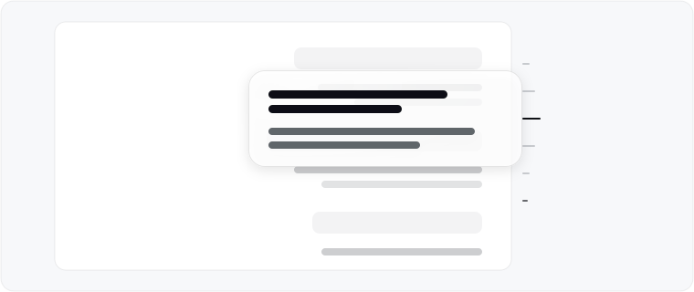

<p align="right"><a href="README.md">简体中文</a> · <a href="README.en.md">English</a></p>

# dsh-ui-outline

<p align="center"></p>

A turn navigation rail for [DeepSeek Harness](https://github.com/deepseek-ai/deepseek-harness) (dsh 0.2.1) web (desktop shell embeds the same web client). Hugs the conversation edge, centers on the reading band, and hides below 900px column width. The 44px hit strip snaps clicks to the nearest turn and supports drag scrubbing.

- **Mark layout**: `compact` (official 10px pitch, scrolls when overflowing) or `loose` (30px row per turn).
- **Preview material**: `none` (opaque official card), `frost` (default: veil + bright rim + extra blur), or `liquid` (thin lens with the same bright rim + subtle blur, translucent with no reflection or SVG).

## Install

Requires dsh `0.2.1`.

```sh
dsh plugin --profile web add dsh-ui-outline
dsh plugin --profile web add github:iluluyu/dsh-ui-outline
dsh plugin --profile web add .   # run from the plugin directory; relative paths are anchored to the invoking directory
dsh plugin --profile web add file:/absolute/path/to/plugin
```

Restart `dsh web` and reload. Uninstall: `dsh plugin --profile web remove dsh-ui-outline`.

## Settings

*Plugins → dsh-ui-outline*. Defaults: right, compact, frost (transparency 80, blur 6). Liquid standard is transparency 75, blur 4. Airy / Standard / Misty write both knobs at once.

## License

MIT © iluluyu
