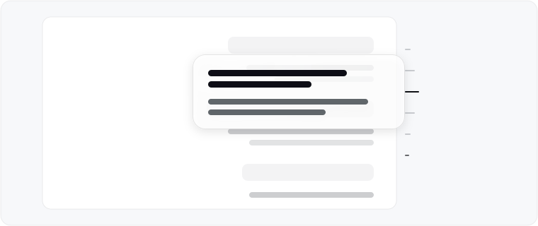
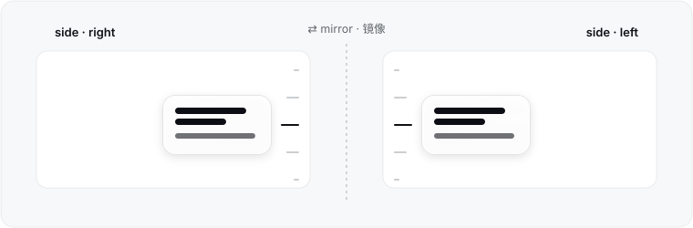
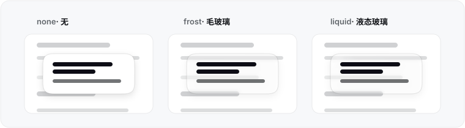
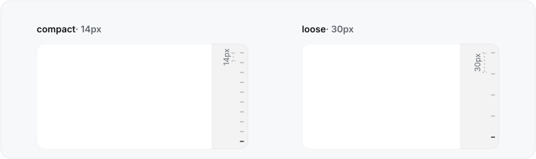

<p align="right"><a href="README.zh-CN.md">简体中文</a> · <a href="README.md">English</a></p>

<h1> dsh-ui-outline</h1>

> A turn rail for [DeepSeek Harness](https://github.com/deepseek-ai/deepseek-harness) (dsh) web — the official TurnNavigator design language, plus the choices the official rail doesn't give you.

<p align="center">
  
</p>

## Why

- **Official DNA.** The rail hugs the conversation column edge (the details panel never collides), centers on the live reading band, and hides below a 900px column — exactly like the shipped navigator. Every color, radius, shadow, and motion curve resolves live from the host's design tokens.
- **A living mark language.** Idle ticks rest in perfect alignment; the current turn is highlighted by color alone; hovering sweeps a neighbor wave. One language, two densities — `compact` (14px pitch, whole history in view) or `loose` (one real 30px row per turn).
- **Forgiving input.** The strip is 44px wide and snaps every click to the nearest visible turn — the 2px line is never the target. Drag to scrub the whole conversation; a quiet landing flash marks click-arrivals, while fast scrubs stay animation-free.
- **Glass, done carefully.** The per-turn preview card in three finishes: `none` (official opaque tokens), `frost` (default), or `liquid`, where a neutral glint enters from the conversation-facing corner and a Fresnel-thin rim catches the edge. On Chromium, liquid runs the backdrop through a real displacement lens (an SDF normal map consumed by `feDisplacementMap`), so content near the card edge bends into the glass — the thick-lens fold; other engines keep a plain blur fallback. Each finish keeps exactly one rim line: a real 1px border flush against the glass (no ring-shadow gap). Each glass ships three presets — airy (transparency axis) · standard (the balance point) · misty (blur axis) — plus custom transparency and blur-radius sliders. Never overflows the page.
- **First-class settings.** Lives in *Settings → Plugins → Plugin configuration*, persisted in the host's settings document — preferences follow you across browsers and machines. Not localStorage.
- **Cheaper than a shadow.** Scrolling costs one rect read plus a binary search per frame; every animation is compositor-only; pointer moves coalesce to one job per frame; a settled outline re-renders nothing while you read.
- **Never two rails.** While this rail is up, the official one stands down — and below two turns (the official minimum) this one stands down instead.

## Install

Requires dsh ≥ `0.1.0-rc.7` (keyed plugin-settings slot + open settings namespaces).

From npm:

```sh
dsh plugin --profile web add dsh-ui-outline
```

Or straight from GitHub (pin a tag or branch if you like):

```sh
dsh plugin --profile web add github:iluluyu/dsh-ui-outline
# pinned to a tag/branch:
dsh plugin --profile web add github:iluluyu/dsh-ui-outline#v0.0.2
```

Both paths behave identically; update with `dsh plugin --profile web update dsh-ui-outline`, remove with `dsh plugin --profile web remove dsh-ui-outline`. Restart `dsh web` and reload the page to activate.

## Settings

All settings apply live and persist in the host settings document:

| Setting | Options | Default |
|:--|:--|:--|
| **Side** | Right · Left | Right |
| **Preview material** | None · Frosted · Liquid glass | Frosted |
| **Glass parameters** | Presets: Airy · Standard · Misty + Custom (transparency / blur-radius sliders, shown only while its material is selected) | Standard |
| **Mark layout** | Compact · Loose | Compact |

<p align="center">
  
</p>

<p align="center">
  

<p align="center">
  
</p>

<p align="center">
  
</p>

The card is bilingual zh/en, tracking the app locale. The settings namespace is `outline`; a manual override looks like `outline: { side: left, material: frost, frostTransparency: 65, frostBlur: 10 }` in `~/.dsh/settings.yaml`. The plugin's `cordis.yml` row also carries a `config:` block — it layers *under* the user document, so profile owners can pin fleet-wide defaults that personal settings always override.

## Performance

- **Reading is free.** Scroll tracking reads one rect per frame and binary-searches cached turn offsets, refilled only when the conversation DOM changes.
- **Streaming doesn't ripple.** Unchanged rows reuse their objects; a settled outline re-renders nothing while you read. Snippets read `textContent`, never the layout-forcing `innerText`, and only the newest step per turn.
- **Compositor-only motion.** The wave, the preview card's glide, and every entrance animate `transform`/`opacity` — animating coordinates would relayout the fixed rail every frame, so nothing does.
- **Coalesced pointers.** Pointer moves become one read-then-write job per animation frame, so scrubbing costs O(1) layouts regardless of pointing-device frequency.
- **Contained by construction.** The rail is `position: fixed` inside the click-through overlay layer: it can never stretch the page or add a scrollbar.

## Design notes

- Design tokens (`--dsw-alias-*`) resolve live from the host page with the official first-paint fallbacks, so theme changes and future token updates are picked up automatically.
- The rail anchor, reading-band geometry, and preview interaction follow the official TurnNavigator. The mark language (aligned rest + color highlight + wave) and the 14/30px density split are this plugin's own ergonomics.
- 18.4px corner radius, plain circles — the shape this card has effectively always rendered as. (A G2 `corner-shape` upgrade was explored and abandoned with measurements: the `squircle` keyword silently computes to a plain circle in Chrome 152; the explicit `superellipse(4)` collapses the perceived radius at any matching scale; and Chrome's default `corner-shape` is already `superellipse(1.5)`, which is the look users know — see docs/theme-plan.md.)
- Reduced motion is respected throughout.

## Credits & license

- Design language follows the **TurnNavigator** in the official [deepseek-harness](https://github.com/deepseek-ai/deepseek-harness) (MIT, © DeepSeek): rail geometry, reading-band centering, and hiding thresholds all match the official behavior.
- The neighbor wave (nearby marks stretching with distance decay under the pointer) and drag-to-scrub were informed by the floating thread-navigation rail built into **OpenAI's ChatGPT desktop app** (Codex desktop).
- Liquid-glass layering — and the displacement-lens technique (SDF normal map + `feDisplacementMap` on the backdrop) — was informed by [DevBehindYou/LiquidLens](https://github.com/DevBehindYou/LiquidLens) and [tomagranate/liquid-glass](https://github.com/tomagranate/liquid-glass) (both MIT); the implementation here is independent, with a deliberately neutral (non-chromatic) lens after per-channel CA was measured to fringe text edges.
- Runs on dsh: plugin host **cordis**, React runtime provided by the host; settings schema via **@deepseek-ai/schemastery** (MIT).
- No third-party code is bundled; no transitive license obligations.

MIT © iluluyu

## Development

Zero-build: `lib/` is both source and artifact. Turn discovery is DOM-based (`[data-conversation-scroll]`, `[data-chat-flow-kind="user"]`), decoupled from the snapshot API; geometry reads the official CSS variables off the live scrollport.

```sh
git clone https://github.com/iluluyu/dsh-ui-outline
npm run check        # syntax gate
```

| File | Role |
|:--|:--|
| `cordis.yml` | bundle patch: one loader row into the Web profile |
| `lib/index.js` | node half: registers the `outline` settings namespace |
| `lib/client.js` | browser half: the rail + preview card (into `shell.overlay`) and the settings card (into `settings.plugin.item`) |

Local dev: point the profile at the working copy (`"dsh-ui-outline": "link:/path/to/outline"`, `pnpm install` in both), restart `dsh web`, hard-reload.

---

**Keywords**: dsh plugin · dsh 插件 | deepseek-harness · DeepSeek Harness 插件 | turn navigation · 轮次导航 | thread navigator · 对话导航 | conversation outline · 会话大纲 | chat history · 对话记录 | sidebar rail · 侧边栏导航条 | glassmorphism · 玻璃拟态 | frosted glass · 毛玻璃 | liquid glass · 液态玻璃 | backdrop filter · 背景滤镜
